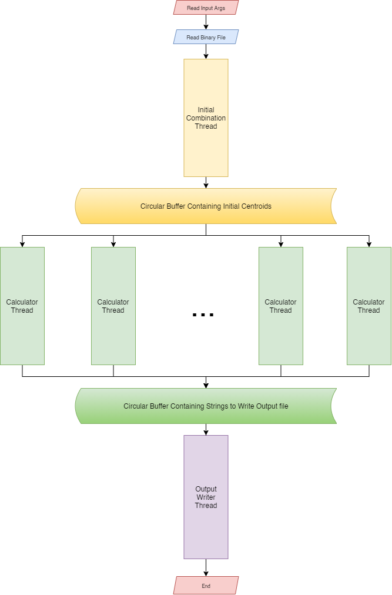

For better visibilty please open this file with a modern MarkDown(.md) reader.

# LEPL1503-2021-GROUPEB13
Below, you will find everything you need know about our project from the course LEPL1503.

## 1. Our Objective

Our goal is, given a Python code which does resolve a K-means problem, we have *to do a C version of the code/program*. 
The C program must do the exact same thing as the Python program but must be faster. In addition, we must do a parallel computing (using Threads...because we love them ). More to that our C program must run well on Raspberry Pi.

For more specifications, check out [here](https://moodleucl.uclouvain.be/pluginfile.php/2227387/mod_resource/content/1/lepl1503_enonce_2021.pdf).

### 1. 1 User inputs

The user has a certain power over the perfomance of the program since she/he has to determine the following arguments : 

| Argument | Meaning |
| :------- | :------ |
| **-q** if specified | The program does not display the content of clusters in the output |
| **-k** n_clusters (by default: 2) | The number of clusters to calculate |
| **-p** n_combinations (by default: The same value as n_clusters)|  We consider the n_combinations first points present at the input to generate the initial centroids of the algorithm of Lloyd |
| **-n** n_threads (default: 4) | The number of compute threads that are used to solve k-means |
| **-d** distance_metric (default: "manhattan") | Either "euclidean" or "manhattan" (all written in small letters). It's about the name of the formula to use to calculate the distance between two points.|
| **-f** output_file (by default, we write to the standard output) | The path to the file for write the result (see the output format in section 5.2) |
| input_filename (by default, we read the standard input) | The path to the binary file which describes the list of grouper points (see entry format in section 5.1)|

## 2. Folder Organisation

Our project folder is like follow:
```
|time_data/
|headers/
|input_binary/
|output_files/
|src/
|tests/
|main.c
|Makefile
|README
```

* All files that end with **.h** will be in `headers` folder. As the name of the folder indicate, this will contain our custom headers used in the project. 
* All files in `src` folder are source files **.c**, that implement the functions defined in their corresponding headers in `headers`.
* `main.c` is our main file.
* `input_binary` folder contains exmaples of input binary files.  
* The `output_files` folder contains files that the program use to write in the results.
* time_data, contains our time executions time.

## 3. System Architecture
In order to keep our code easily maintanable and understable, we had to use various software design techniques :

### 3. 1 Modular Programming
It is a software design technique whose aim is to separate the functionalites of a whole program into different (nearly) independent modules.

In our project we have about 9 modules : 

| Module            | Purpose                                                 | Dependency On Other Modules |
| ----------------- | :------------------------------------------------------ | ---------: |
| argumentsParser   | Its main purpose is to parse the user input arguments. | Yes | 
| arrayofclusters   | Contains all the functions and structures that will be used for arrays of clusters| Yes | 
| arrayofpoints     | Contains all the functions and structures that will used when initialising array of points | Yes |
| circularbuffer    | Contains the buffer's structure and its functionnalities needed in order to use buffer throughout our program | No|
| combinator        | The combinator's main purpose is to enumerate all the combinations of centroids based on the inputs. | Yes |
| distance          | The distance module contains all functions that calculates distances | Yes |
| filehandler       | This module's main goal is to treat files, whether it's reading or writing | Yes |
| func              | This modules has a special name, cause it's the module that holds the function that calculates the problem of kmeans. | Yes |
| point             | This module contains points' structure (in french: La structure d'un/des point(s)) and its functionalites which needed in most modules | No |
| threadsHandler    | Finally, this module handles the multi threading tasks | Yes |


Note that these modules are nearly independent. It was the intention, because the main goal was to have a program that's easily understable and maintanable rather than completely independent.

### 3. 2 Data abstraction Programming
The idea is to use structures whenever we can use them. Given that C doesn't support Object Oriented Paradigm we had to use structures in order to have a certain level of abstraction, hence improving the coding experience.

Below are the structures that we used in our program. For more detailed specifications we recommend to check the `headers` file in which they are initiated.

#### 3. 2. 1 Points/Centroids [headers/point.h]
Mathematical points with a certain dimension are represented as below : 

```c
typedef struct 
{
    uint32_t dimension;
    int64_t * values;
} point_t;

typedef point_t centroid_t ; 
```

Where values is a pointer to the array of values of the point. Since centroids are points they are defined the same way.

#### 3. 2. 2 Clusters/Array Of Points [headers/arrayofpoints.h]

An array of points is an array of a fixed sized that contains a list of the `point_t` structure defined above [3. 2. 1].   

```c
typedef struct {
    uint32_t size;
    point_t * points;
} array_of_points ;

typedef array_of_points array_of_centroids;
typedef array_of_points cluster_t
```

#### 3. 2. 3 Array Of Clusters [headers/arrayofclusters.h]

An array of clusters is used to store arrays of points.

```c
typedef struct
{
    uint32_t size;
    array_of_points * array;
} array_of_arrays_of_points ;

typedef array_of_arrays_of_points array_of_arrays_of_centroids;
typedef array_of_arrays_of_points array_of_clusters;
```

#### 3. 2. 4 Circular buffer [headers/circularbuffer.h]

We used a circular buffer in order for threads to share data throughout the program execution.

```c
typedef struct 
{
    uint32_t maxSize;
    void ** array;
    uint32_t takePointer;
    uint32_t putPointer;
    uint32_t in;
    int done;
    sem_t * empty;
    sem_t * full;
    pthread_mutex_t * mutex;
    uint64_t waitingConsumers;
    uint64_t waitingProducers;
} circular_buf ;
```

#### 3. 2. 5 Input Binary File [headers/filehandler.h]

We use this structure as a representation of the input binary file.

```c
typedef struct fileStruct{
    point_t * ptrToPoints;
    uint32_t dimension;
    uint64_t nbOfPoints;
} file_t ;
```

#### 3. 2. 6 User Input Arguments [headers/argumentsParser.h]

We created also a structure to hold all the user's input arguments given in terminal.

```c
typedef struct {
    char * input_pathName;
    char * output_pathName;
    uint32_t n_threads;
    uint32_t k;
    uint32_t n_first_initialization_points;
    bool quiet;
    squared_distance_func_t squared_distance_func;
}args_t;
```

They are other small local structures used inside `src` files. We initiated them there since they will used only locally. They are self explanatory, an example will be a structure used to hold all the arguments for a specific type of thread.

### 3. 3 Concurrent Programming
For the multi threading, we used POSIX threads. Our goal was to separate the code into 3 main parts of the program in order to have a real sense of parallelism. Our three main parts are :

* Generating Initial Centroids Combinations. There is only 1 thread executing this part, **Initial Combination Thread**. This thread is given a maximum priority depending on the scheduler policy.

* Calculating Final Clusters and Centroids. The number of threads executing this part is **-n**, corresponding to the user input, other wise it's 4 by default. These threads will be called **Calcutor Threads**.

* Writing the result to the csv file. There is only 1 thread executing this part, **Ouput Writer Thread**.

#### 3. 3. 1 Design

The design we used throughout our project is the `Consumer/Producer Pattern`. This design pattern means that some threads produce while others consume what the producers produced. This design pattern is used twice in our project : 

* The **Initial Combination Thread**, produces initial centroids which are to be consumed by the **Calcutor Threads**.
* The **Calcutor Threads**, produce the output string after calculating the final centroids and final clusters, these strings are then consumed by the **Ouput Writer Thread**, which saves them to the csv file.

We used semaphores and mutex to handle communication and exclusivity respectfull in our project. For a better fluid program, producers were given an extra task. When producers are done producing they must signal the corresponding consumers and wake all possibly waiting consumers on the same buffer.

In order to ensure that we consume the least memory possible. Once consumers are done using a data-unit they must free it, to prevent the heap overflow. Hence, our program memory consumption throughout the execution is minima.

#### 3. 3. 2 Data Structure 

The data structure used for holding the result is a circular fixed size buffer. The size of the buffer is equal to the user input number of threads. We choose a fixed size because of various reasons, the main reason was that since, a Raspberry Pi is an embedded computer with (1GB RAM), for big computations a varying size buffer may cause a heap overflow. Therefore with our data structure we are more than sure that it won't be a problem.

### 3. 4 Image :

.

A system architecture image can be found in `images` folder.


### 3. 4 Error Handling

Error handling is a big task in C programs, since there's no concept of exceptions. However one can use *gotos*, but they are complex to manage so we opt for checking returned signals by functions. The disadvantage of the chose option is that the code is longer and is filled with a lot of ifs conditions.

The main aim with our error handling was that incase of an error the program must end correctly, by freeing all the resources and signaling all the other threads.

 In order to manage erros we had to define two type of errors that can determine the flow of our program :

* **Critical Errors**, when these errors occur the execution of the current function ends right away. Before exiting the function we still free the resources used in that function and we return a signal indicating that an error occured.

    Here's an pseudo code example showing how we treat **Critical Errors**.

    ```C
    if (pointer == NULL)
    {
        /* Free resources */
        return signalOfError;
    } 
    ```

* **Consequential Errors**, when these errors occur the execution doesn't end right away but the course of the execution changes in order to free larger resources or notify other parts of the program.

    Here's a pseudo code example showing how we handle **Consequential Errors**.

    ```C
    int possibleError = 0;

    /* Some code */

    if(pointer == NULL)
    {
        possibleError = 1;
    }
    /* Some other code */

    if(possibleError == 0)
    {
        /* Some code again that only run if there's no consequential error */
    }

    return signalError;
    ```

Notice : 

* **Consequential Errors** can be handled as **Critical Errors** but the code will be unreadable and redondant that's why we had to organize our code this way.

* We don't evaluate all the returned values by all functions because of the readibility. Par example, mutexes can only have an error if the programmer, mismanaged the locking and unlocking of them. So we make the hypothese that nobody is going to modify our code, and that we already handled all, possible errors that can be caused by us. On the other hand, returned values of functions that depend on the system like, `malloc`, semaphores, etc will always be checked. The sources used to determine all possible errors are man pages provided in our course [LEPL1503 - Projet 3].


## 4. Code Execution
In order to executing our code. You just need to execute the following command in the directory : 
```
> make kmeans
```
Once the program is compiled then you can run the runnable `kmeans` like this ;
```
> ./kmeans [arguments] 
```
For [arguments]: see 1.1 above if needed

## 5. Testing

The tests are in the `tests/` directory. 

### Goal 

The main goal of our test is to check if the modules we defined in `headers` and implimentated in `src` work as they should. For that reason, most files in `src` will have a test. It is important to note that it is possible that one `src` file depends on another file for it be fully functional, a dependency table is available in section [3.1].

We also use the python code given to test the output of the whole function. And the speed of the main.c if we increase the number of threads on multi core systems.

### Requirements

We use `CUnit` to test our functions. In order to run our tests, this library must be installed, here's the [link](https://sourceforge.net/projects/cunit/files/) to the sourceforge site.

### Execution
Once installed, open terminal, go to the project's directory and execute,

```
make tests
```

All the tests will be executed and a failure report will be displayed for each test.

## 6. Makefile

There is Makefile in the root directory, this makefile contains the following commands to facilitate the compilation of various C files. Note that all of the following commands are to be run in the terminal ( prefably on a Linux Operating System).

### Requirements 

We used various in built commands for our makefile, one may need to install some of them :

* **CPP Check** : A static tool for bugs and undefined behaviour detection. [Install](http://cppcheck.sourceforge.net/)

* **Valgrind** : A dynamic analysis tool for memory leak detection, threading bugs etc. [Install](https://riptutorial.com/valgrind/example/32345/installation-or-setup)


| command            | functionalities                                             |
| :----------------- | :---------------------------------------------------------- |
| make kmeans        | Compile the kmeans executable object.|
| make tests         | Execute all our tests with failure reports.|
| make valgrind      | Execute examples, with valgrind in order to verify if there's some memory leaks or deadlocks.|
| make clean         | Cleans all executables and object in the root directory and it's children directories.|
| make clean_objects | Cleans all the objects and executables in the root directory and it's children directories except, `kmeans` executable. |
| make all_cppcheck  | Execute cppcheck on all our sources files and main.c |
| make timeExecute   | Execute a number of times the kmeans in order ro evaluate the time used |
| make check         | Executes `make valgrind`, `make all_cppcheck` and `make timeExecute`|
